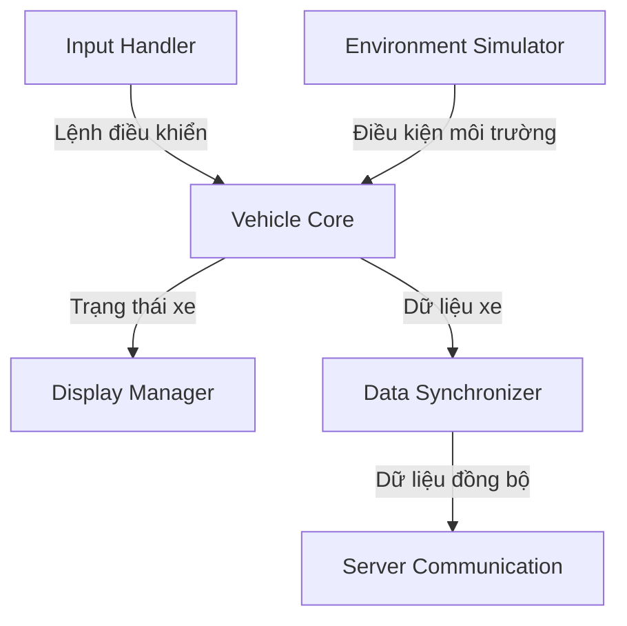

# Thiết kế chi tiết hệ thống mô phỏng xe

## 1. Kiến trúc tổng thể

### 1.1 Các thành phần chính

- **Vehicle Core**
  - Quản lý trạng thái xe (tốc độ, pin, nhiệt độ,...)
  - Xử lý logic điều khiển xe
  - Đồng bộ hóa dữ liệu giữa các module

- **Environment Simulator**
  - Mô phỏng điều kiện môi trường (nhiệt độ, địa hình)
  - Tính toán ảnh hưởng môi trường đến xe
  - Cập nhật trạng thái môi trường theo thời gian thực

- **Input Handler**
  - Xử lý đầu vào từ bàn phím
  - Chuyển đổi lệnh thành hành động xe
  - Kiểm tra tính hợp lệ của đầu vào

- **Display Manager**
  - Hiển thị thông tin xe theo thời gian thực
  - Cập nhật giao diện người dùng
  - Xử lý animation và hiệu ứng

- **Data Synchronizer**
  - Đồng bộ dữ liệu giữa các luồng
  - Quản lý truy cập vào dữ liệu chia sẻ
  - Đảm bảo tính nhất quán của dữ liệu

### 1.2 Luồng dữ liệu

## 2. Chi tiết các module

### 2.1 Vehicle Core

#### Trạng thái xe
- Vận tốc (km/h)
- Mức pin (%)
- Chế độ lái (ECO/SPORT)
- Trạng thái hệ thống (khóa cửa, dây an toàn)

#### Logic điều khiển
- Xử lý tăng/giảm tốc
- Quản lý chuyển đổi chế độ
- Kiểm tra điều kiện an toàn

### 2.2 Environment Simulator

#### Các yếu tố môi trường
- Nhiệt độ không khí
- Độ ẩm
- Địa hình (bằng phẳng, dốc)
- Điều kiện thời tiết

#### Tính toán ảnh hưởng
- Tiêu hao pin theo điều kiện
- Hiệu suất động cơ
- Độ bám đường

### 2.3 Input Handler

#### Xử lý phím
- Ga (Space)
- Phanh (Enter)
- Chuyển số (P,R,N,D)
- Chuyển chế độ (M)

#### Kiểm tra hợp lệ
- Điều kiện chuyển số
- Giới hạn tốc độ
- Trạng thái an toàn

### 2.4 Display Manager

#### Hiển thị thông tin
- Vận tốc và RPM
- Trạng thái pin
- Cảnh báo hệ thống
- Thông tin môi trường

#### Giao diện người dùng
- Layout màn hình
- Hiệu ứng chuyển đổi
- Animation đồng hồ

### 2.5 Data Synchronizer

#### Cơ chế đồng bộ
- Mutex cho dữ liệu chia sẻ
- Queue cho truyền thông điệp
- Semaphore cho đồng bộ luồng

#### Quản lý dữ liệu
- Buffer cho dữ liệu tạm thời
- Cache cho truy cập nhanh
- Log cho theo dõi hệ thống

## 3. Tương tác giữa các module

### 3.1 Luồng xử lý chính

1. Input Handler nhận lệnh từ người dùng
2. Vehicle Core xử lý lệnh và cập nhật trạng thái
3. Environment Simulator tính toán ảnh hưởng môi trường
4. Display Manager cập nhật giao diện
5. Data Synchronizer đồng bộ dữ liệu với server

### 3.2 Xử lý sự kiện

#### Chuyển chế độ lái
1. Kiểm tra điều kiện chuyển chế độ
2. Cập nhật giới hạn tốc độ
3. Điều chỉnh hiệu suất động cơ
4. Cập nhật giao diện

#### Cảnh báo an toàn
1. Kiểm tra các điều kiện an toàn
2. Phát sinh cảnh báo khi cần
3. Hiển thị thông báo trên giao diện
4. Ghi log sự kiện

## 4. Cơ chế đồng bộ hóa

### 4.1 Mutex
- VehicleDataMutex: Bảo vệ dữ liệu xe
- EnvironmentMutex: Bảo vệ dữ liệu môi trường
- DisplayMutex: Bảo vệ giao diện

### 4.2 Semaphore
- InputSemaphore: Điều khiển luồng đầu vào
- DisplaySemaphore: Đồng bộ cập nhật giao diện
- ServerSemaphore: Đồng bộ gửi dữ liệu

### 4.3 Message Queue
- CommandQueue: Hàng đợi lệnh điều khiển
- EventQueue: Hàng đợi sự kiện
- UpdateQueue: Hàng đợi cập nhật

## 5. Xử lý lỗi và ngoại lệ

### 5.1 Các loại lỗi
- Lỗi đầu vào không hợp lệ
- Lỗi đồng bộ hóa
- Lỗi kết nối server
- Lỗi hệ thống

### 5.2 Cơ chế xử lý
- Try-catch cho xử lý ngoại lệ
- Timeout cho các hoạt động đồng bộ
- Retry cho kết nối server
- Fallback cho các tính năng không khả dụng

## 6. Mở rộng hệ thống

### 6.1 Thêm tính năng mới
- Tích hợp module mới
- Mở rộng giao diện
- Bổ sung luồng xử lý

### 6.2 Tối ưu hiệu năng
- Cache dữ liệu
- Pool thread
- Lazy loading
- Batch processing